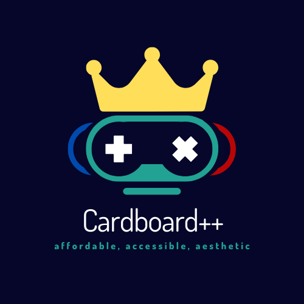
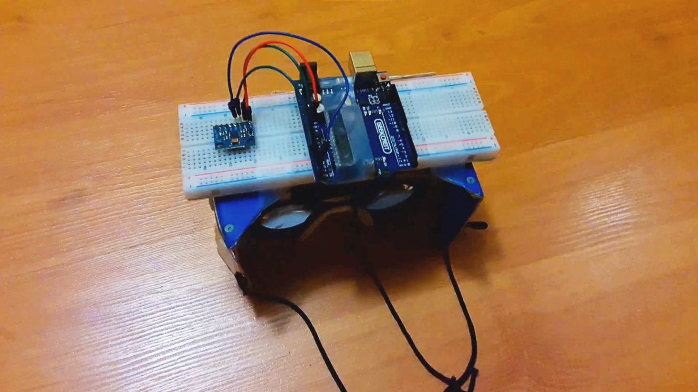

<p align="center">
  
 </p>

# Cardboard++
accessible VR based on arduino, google cardboard, and web sockets
<br> <br>
to run cardboard++,
<br>
```
- upload the .ino sketch to an arduino that is attached to a GY-521 module
- start the .ino sketch and open the serial terminal to start the program
- run the .py file to grab data from the .ino sketch
- start the webserver with npm run client
- access the webserver on the device in the Google cardboard and enjoy Cardboard++!
```
<br>
Some cool images of Cardboard++
<br> <br>
<p align="center">
  
  <br>
  the cardboard++ in all its glory
  <br> <br> <br>
  
  <br>
  Hinson sweating minecraft while using cardboard++
 <p>
